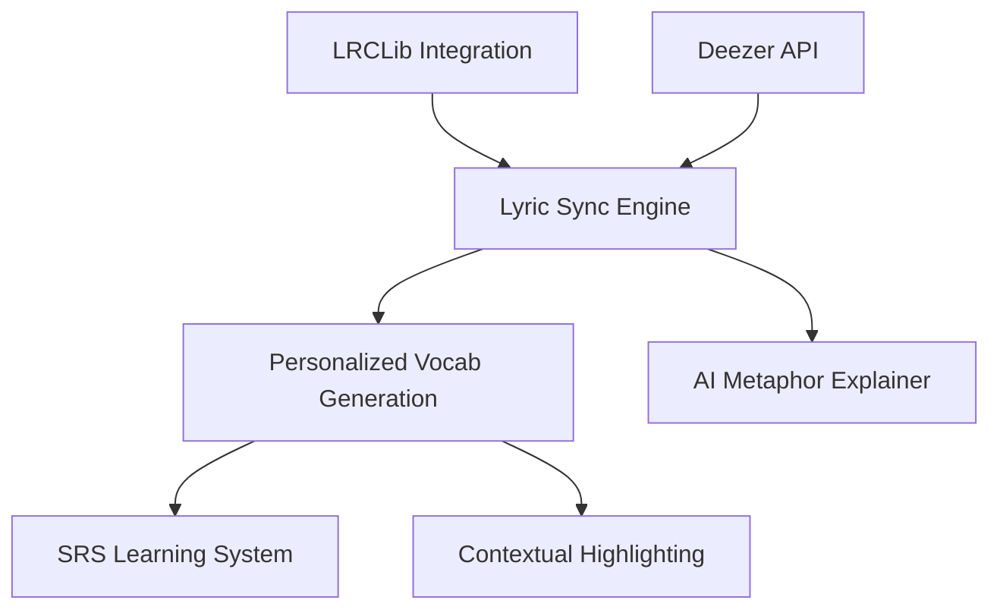

# Feature Landscape: LyricWord

**Domain:** Music-based Language Learning
**Researched:** October 26, 2023 (Updated June 2026)
**Confidence:** HIGH

## Table Stakes

Features users expect in any music-learning app. Missing = product feels incomplete.

| Feature | Why Expected | Complexity | Notes |
|---------|--------------|------------|-------|
| **Synced Lyrics** | Standard "Karaoke" style visualization. | Med | Requires LRC parsing and Web Audio clock. |
| **Audio Snippets** | Listening is core to the methodology. | Low | 30s previews via Deezer API. |
| **Vocabulary Cards** | The "Learning" part of the app. | Low | Simple flashcard UI with SRS logic. |
| **Search/Discovery** | Users want to learn from songs they like. | Med | Search integration with LRCLib/Deezer. |

## Differentiators

Features that set LyricWord apart from basic lyric apps.

| Feature | Value Proposition | Complexity | Notes |
|---------|-------------------|------------|-------|
| **AI Metaphor Decoder** | Explains poetic lyrics and slang that dictionaries miss. | High | Powered by NVIDIA NIM (LLM). |
| **Validation Loop** | Ensures 100% accuracy between lyrics and audio. | Med | Logic to match audio duration to LRC file. |
| **Personalized Vocab** | Generates 5-10 words based on user CEFR level. | High | AI analyzes lyrics to pick optimal words. |
| **Contextual Audio** | Replay the specific timestamp of a word in a song. | Med | Deep-linking audio timestamps to vocab popovers. |

## Anti-Features

Features to explicitly NOT build to avoid legal or scope issues.

| Anti-Feature | Why Avoid | What to Do Instead |
|--------------|-----------|-------------------|
| **Full Song Playback** | High licensing cost and copyright risk. | 30s previews + link to Spotify/YouTube. |
| **Community Lyrics** | Risk of inaccuracy and "hallucination." | Strict validation against LRCLib/Deezer. |
| **Native Mobile App (v1)** | Slower iteration and approval cycles. | Focus on high-quality PWA. |

## Feature Dependencies

## MVP Recommendation

Prioritize for Phase 3:
1. **AI-Personalized Vocab**: Selecting words via NVIDIA NIM based on user's target CEFR level.
2. **Contextual Highlighting**: Mapping extracted words back to LRC lines for interactive UI.
3. **Definition Popovers**: Accessible UI for viewing context-aware definitions.

## Sources
- [Competitor Analysis: Lirica, LyricsTraining, Sounter]
- [CEFR Level Descriptions for Language Learning]
