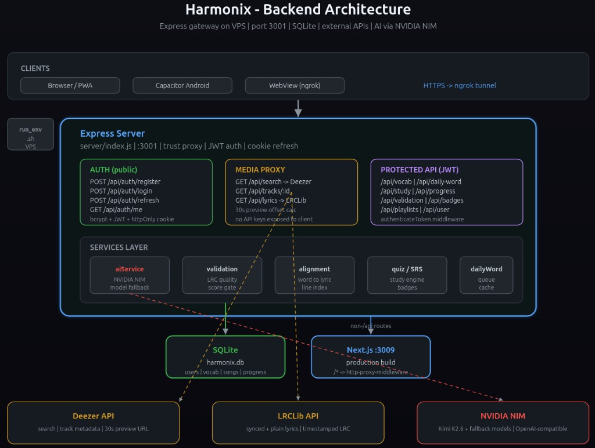
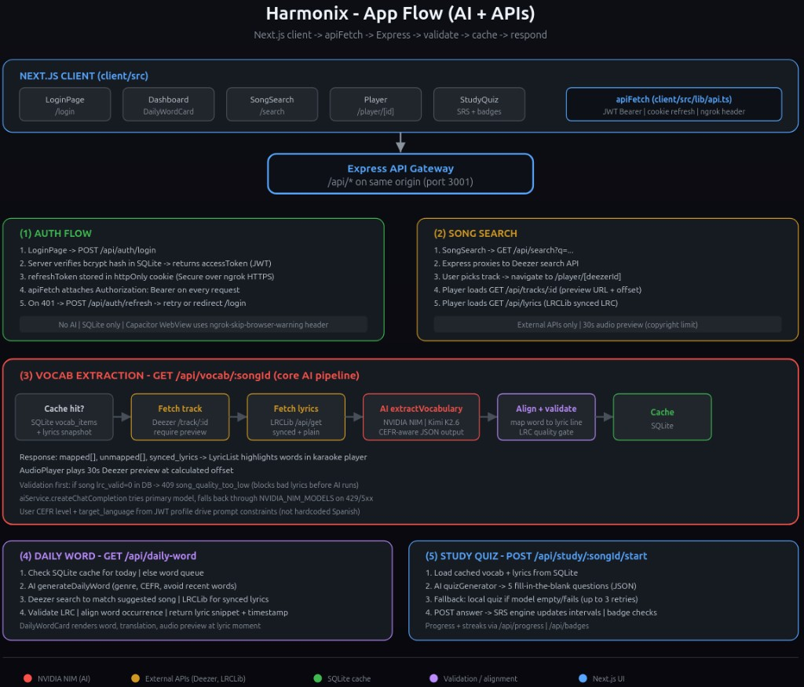

# Architecture diagrams

Dark-mode overviews of how Harmonix is wired. PNG previews render on GitHub; SVG sources are editable in any browser or VS Code.

## Backend architecture

VPS layout: Express gateway, routes, services, SQLite, Next.js proxy, external APIs.

Sources: [backend-architecture.svg](./backend-architecture.svg) · [backend-architecture.png](./backend-architecture.png)

## App flow (AI + APIs)

Client screens, API calls, NVIDIA NIM, Deezer/LRCLib, validation, and SQLite cache.

Sources: [app-flow.svg](./app-flow.svg) · [app-flow.png](./app-flow.png)
